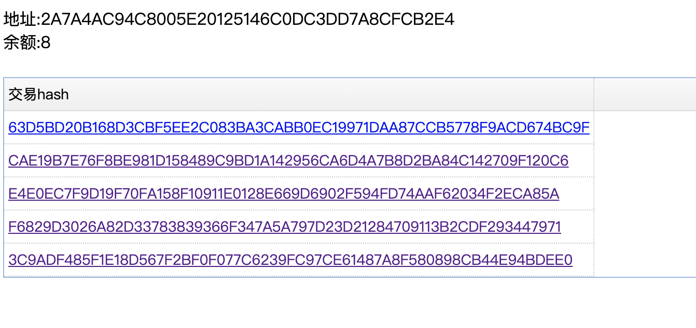
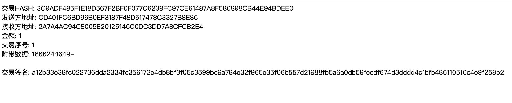

<h1>Domainchain</h1>

<div>
 基于 cosmos 实现的域名生态链 <br/>
 基于DPOS+BFT共识引擎 <br/>
</div>
<br/>

## 特性

- 基于 cosmos 实现
- 基于DPOS+BFT共识引擎
- 编码采用proto协议
- 仅供学习探讨，勿用于生产用途；

## 当前主要功能

- 核心区块链：处理共识、打包区块、数据传输等；
- 钱包功能：发行、转账、数据上链；
- 区块浏览器：查看区块、查看交易信息；

## 计划中的功能

- web2.0域名的认领绑定；
- 支持域名-其它链或币的地址映射；
- 完善钱包、区块浏览器的web页面体验；
- 数据追溯验证；

### 获取代码

```
go get -v github.com/it234/domainchain
```

### 运行

- 运行：cd cmd/domainchain，go run main.go；
- 浏览器打开 127.0.0.1:9102 可以进行钱包相关操作；
- 浏览器打开 127.0.0.1:9101 可以查看区块数据；

## 界面截图
<details>
<summary>展开查看</summary>
<br>
<br/><br/>
<br/><br/>
<br/><br/>
<br/><br/>
<br/><br/>
<br/><br/>
<br/><br/>
<br/><br/>
</details>

## Donate

- If you find this project useful, you can buy author a glass of juice 
- alipay
- 
- wechat
- 
- [Buy me a coffee](https://www.buymeacoffee.com/it234)
- bitcoin address : 1LwTcCZ1p5kq8UokZGUBVy3BL1wRa3q5Wn
- eth address : 0x68ca43651529D12996183d09a052a654F845cB89
- eos address : 123451234534

## 感谢以下框架的开源支持

- [cosmos] - [https://cosmos.network/](https://cosmos.network/)
- [Gin] - [https://gin-gonic.com/](https://gin-gonic.com/)


## MIT License

    Copyright (c) 2022 it234

## 与作者对话

> 作者微信号：it23456789，微信二维码：


